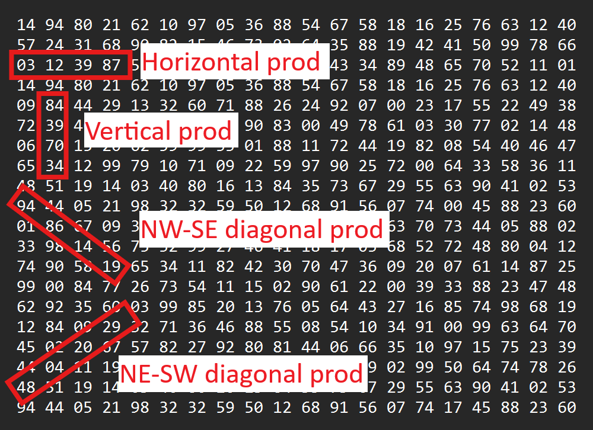

## gridanalyzer 

The **gridanalyzer** package contains classes to parse and find the largest product of *k* consecutive numbers in a square matrix.
  
- *GridParser* parse a .txt-file containing an *n* x *n* matrix. 
  - The static method *parse()* takes a Path-object as argument pointing to the file containing the matrix, and returns the matrix as an int[][].
  
- *GridProduct* is a record that stores a product calculated from a matrix along with its factors and indices of the factors.
  
- *GridSolver* finds the largest product of *k* consecutive numbers in an *n* x *n* matrix. Results are returned as a list of GridProducts (the list will contain more than one *GridProduct*s just in case two or more calculated products are equal)
  - The static method *solve()* takes an int[][] *grid*, and an int *kConsecutive* of the number of consecutive numbers,  as input.   
  - The *k* consecutive numbers can either be horizontal, vertical or diagonal (North West to South East and North East to South West) - see illustration below (*k* = 4).

Image: The four directions in which the product of *k* consecutive numbers are calculated.

